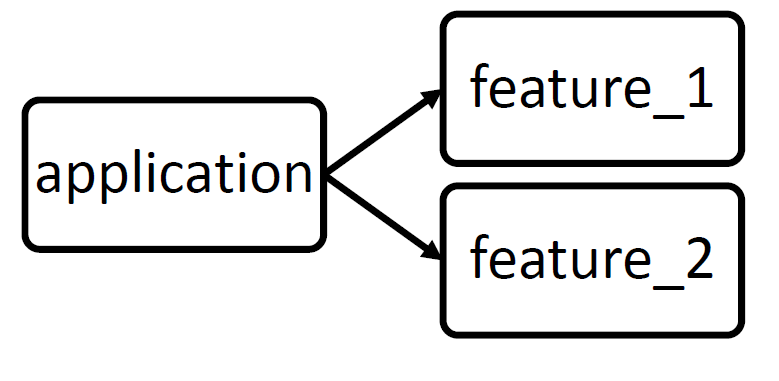

# Modularizing „Pocket Code“: Using Android modules

The main idea of the project was to split up the two logical parts of the Pocket Code application. 
Since the app can be seen as a game engine, these two parts can be determined as the IDE and the Stage. 
Where the IDE part is responsible for the Navigation through the app and external sources and also the editing of the user’s projects. 
When executing the created projects, the Stage parts comes to its work and tries to execute the selected project. 
To start this kind of bigger project, the first idea was to split up the stage part from the IDE part.

## *Android Library Module*

First approach was to create an Android library module `-> apply plugin: ‘com.android.library’`. 
A library module is basically the same as an application module `-> apply plugin: ‘com.android.application’`. 
But an application module is a fully standalone able Android application which can be built to an APK. 
A library module is basically code and resources which are getting packed into an AAR File to be (re)used by an Android application module. 
The idea was to create a library module for the Stage part of the Pocket Code application.

### Multi-module version handling

After researching for best practices, first thing was to create a Gradle file which should be used to store version codes for all used packages. 
When using multiple modules and they are all using e.g. libraries like Espresso, the best case should be that each module uses the same versions. 
Since our newly created library module has its own Gralde file, we can also select specific libraries to be only loaded for one module. 
The LibgDx graphics enginge e.g. could be shifted to exist only in Stage module. 
After creating the overall version storage the conversion part of the old application starts.

The created files were: [build.gradle for Stage](https://github.com/DinosaurierRex/Catroid/blob/GSOC-DS-001/Stage/build.gradle) and 
[version.gradle as storage](https://github.com/DinosaurierRex/Catroid/blob/GSOC-DS-001/version.gradle)

### Refactoring: Relevant parts and dependencies between modules
For this task the easiest way to do was to shift all related packages just to the src folder of the newly created module. 
Problem with that is that currently all our code lies in application module. 
Modularizing an app with library modules is basically a one-way ticket. 
An application module can depend on different libraries, but a library cannot depend on an application.  

### Solution: Resolving dependencies
When now starting to shift only the packages, you immediately have to change about 50 Files for refactoring the dependencies (mainly renaming!).
These changes can be seen on this [Commit](https://github.com/DinosaurierRex/Catroid/commit/ba4fe8da271a09d09fbcf795d6cd53f53062763a)
Afterwards its clear to see that there are a lot of dependencies going back to the application module. 
Since we are not allowed to have dependencies to our application module there are basically two options:
* Shifting relevant parts also to module: E.g. Classes Sprite, Project, … are used in both parts and are not clearly separable yet.
  * But it’s possible to just shift those classes also to stage module because then we can also use it in application module.
  * If this is done for all classes, we wouldn’t reach our goal to clearly separate Stage and IDE part and would need a refactoring of all issued classes.
* Refactor every related class to don’t have dependencies back to the application module.
  * After talking to Patrick, we tried to shift from outter to core. But even the smallest only stage related classes (“Actions” in Pocket Code, over a 100 files) have all dependencies to the application module.
  * Each of these dependencies will result in another file which needs to be refactored to be separate.
  
Example for [StopSoundAction.kt](https://github.com/Catrobat/Catroid/blob/develop/catroid/src/main/java/org/catrobat/catroid/content/actions/StopSoundAction.kt). 
he application module package of Pocket Code is called **org.catrobat.catroid**. 
*Four out of five* `import` statements are relating to application module. When looking at the `import` statetements the dependent classes are clearly visible:  
` ... `  
`import com.badlogic.gdx.scenes.scene2d.actions.TemporalAction`  
`import org.catrobat.catroid.common.SoundInfo`  
`import org.catrobat.catroid.content.Sprite`  
`import org.catrobat.catroid.io.SoundManager`  
`import org.catrobat.catroid.pocketmusic.mididriver.MidiSoundManager`   
` ... `  

After releasing and discussing all this issues with the mentors the pull-requests: [PULL-1](https://github.com/Catrobat/Catroid/pull/3660) and [PULL-2](https://github.com/Catrobat/Catroid/pull/3654) got closed.

### Multiple library modules
A further solution was to create a core application module and a library module for each Stage and IDE. Library modules can depend on other library modules.
Dependencies between Stage and IDE would not be a problem anymore BUT this solution would take a rewrite of nearly everything. The core module must manage both
libraries and non of them is actually prepared to be a library. Test and Continues integration workflows would need to be rewritten which exhausts the capacity of 
a single programmer.

## *Android Dynamic Feature Modules*

They are also called Instant Dynamic Feature Modules for Instant apps. They can basically be treated like a library module but the other way round. 
As mentioned before, library modules can not depend on application modules and will be compiled into an AAR File.

### Dependencies when using Dynamic Feature Modules

When speaking of Dynamic Feature modules, each feature needs to dependent on an application module. 
These modules are seen as an extension to an existing application and thus cannot be seen as standalone applications or libraries.

### How to use?

Dynamic feature modules are making use of the Android Play Core Library. 
Their compiling process can also be seen as splitting APK’s. Which means that each feature module will be compiled into an extra APK. 
A user which wants to upload his app needs to upload all APKs to the Google Play store. 
After uploading and deployment, when a user downloads the app, it will only download the application module part APK and install this APK. 
The developers need to manage the download and the installation of the extra feature modules because they are not delivered by default.

### Solution/Conclusion

When reading about this topic, it will become clear that this is not the right way to handle the Pocket Code issue. A possible solution could be to immediately download the Stage Dynamic Feature module at first start, but this is kind of not the way these modules should be used. We would have to manage a Download at the beginning so a user can even start to use the app. Since IDE and Stage are the core modules of the application, they should not be treated separately in a way of splitting up the whole APK in downloadable packages.

# Further work

### Finished work

* Google Sign-In Button  
There was an ImageButton with a picture of the G+ Sign In still in use. Updated the implmentation for this Sign-In button to the offical Google API implementation.  
Pull request for [PR-CATROID-446](https://github.com/Catrobat/Catroid/pull/3625)

* Release 0.9.70  
Helped releasing the version above. Following the Github workflow.
Pull request for [PR-Release-0.9.70](https://github.com/Catrobat/Catroid/pull/3630)

* Fix for `TestUtils.deleteProjects(...)`  
During programming a bug crossed my way where tests are using the `deleteProjects(String.. props)` functions without parameters to clean the whole test directory.
e.g. in some tests projects actually get saved on applications default directory and should be cleaned afterwards but without a parameter this action never happened.
Pull request for [PR-DELETE-PROJECTS](https://github.com/Catrobat/Catroid/pull/3666)

* Android X Migration (Part 1)  
Starting automatic conversion and optimizing imports. Afterwards apply manual adjustments (together with Stefan) to now use AndroidX which will be mandatory for all applications starting from November on.
Pull request for [PR-ANDROIDX-MIGRATION](https://github.com/Catrobat/Catroid/pull/3471

* Release 0.9.71 and Hotfixes 0.9.72, 0.9.73  
After preparing release this version actually got released --> [PR-Release-0.9.71](https://github.com/Catrobat/Catroid/pull/3671)
This resulted in users experiencing an ANR when they updated from the old to the newer version via Playstore. After a first 10h bug hunt we came up with more or 
less rudimental solution to revert changes made in a earlier stage [PR-Hotfix-0.9.72](https://github.com/Catrobat/Catroid/pull/3676/). This doesnt worked at all and after another approximately 10h we finally were able to reproduce the bug. It was a problem with JSON Serialization upgrade and the newer version couldnt handle the 
saved files for Backpack from the older version. This [PR-Hotfix-0.9.73](https://github.com/Catrobat/Catroid/pull/3682) finally solved the error and got released.

* Refactoring of `ProjectManager.java`  
Moved all project loading specific tasks to new class. Tried to remove usages of context that much (mostly only to fetch resource strings). 
Implemented a `StringProvider` interface to avoid passing context. Refactor of test and code usages. This process inclued two versions of a code deduplicaton
refactoring. One with Kotlin Callbacks which didn't feed our needs and the final version used a generic function with Kotlin smart cast and can be found here --> [PR-PROJECT-LOAD](https://github.com/Catrobat/Catroid/pull/3764) To avoid duplicate `for`-Loop calls Patrick helped me out showing me how to use callbacks for this issue --> see `ProjectUpdater.kt`

* Reduce Flakiness in tests
`UserDefinedBricksTest.java` made problems when running on slow Jenkins emulator. UIThread was not finished drawing the UI elements which the test depends on. 
Implemented a custom view action to wait for specific UI condition or fail when timeout got reached.
Pull request for [PR-MAINTENANCE](https://github.com/Catrobat/Catroid/pull/3766)  

* Add new User Defined Brick  
Started implementing CATROID-218 which allows to create a new User Defined Brick. In cooperation with the usability team we provided all the needed `*.9 Files` and  other resources. This created the possibility to start working on the User Defined Bricks projects. This [CLOSED-PR-CATROID-213](https://github.com/Catrobat/Catroid/pull/3516) got took over and was merged with [PR-CATROID-213](https://github.com/Catrobat/Catroid/pull/3575)  

* Important code review for User Defined Bricks project  
Together with Patrick we did a Code review for a major task of the User Defined Bricks ticket --> [CAROID-218](https://jira.catrob.at/browse/CATROID-218) and the [CATROID-218-PR](https://github.com/Catrobat/Catroid/pull/3617). This is a major PR to be able to release v1.0 in future. This actually took two reviews and a team 
crossing discussion.  

* Planning game attendance  
Attendance at two big planning games: One for Catblocks and one for the Regex Editor team in Hildesheim.  

* Rebasing and reopening two old PR's  
There were two PRs that needed to be rebased where the actual author was inactive for a while. [PR-REBASE-1](https://github.com/Catrobat/Catroid/pull/3650) [PR-REBASE-2](https://github.com/Catrobat/Catroid/pull/3651)  

* URL prefix change for S2C  
After releasing a new version of the Scratch2Catrobat converter, they are supporting https. This little PR changed the URL prefix for the Pocket Code application.
Pull request for [PR-CATROID-330](https://github.com/Catrobat/Catroid/pull/3624)  

* Ticket reviews for  
[CATROID-94](https://jira.catrob.at/browse/CATROID-94),
[CATROID-477](https://jira.catrob.at/browse/CATROID-477),
[CATROID-543](https://jira.catrob.at/browse/CATROID-543),
[CATROID-504](https://jira.catrob.at/browse/CATROID-504),
[CATROID-577](https://jira.catrob.at/browse/CATROID-577),
[CATROID-584](https://jira.catrob.at/browse/CATROID-584),
[CATROID-291](https://jira.catrob.at/browse/CATROID-291),
[CATROID-565](https://jira.catrob.at/browse/CATROID-565),
[CATROID-631](https://jira.catrob.at/browse/CATROID-631),
[CATROID-609](https://jira.catrob.at/browse/CATROID-609),
[CATROID-617](https://jira.catrob.at/browse/CATROID-617),
[CATROID-637](https://jira.catrob.at/browse/CATROID-637),
[CATROID-641](https://jira.catrob.at/browse/CATROID-641),
[PAINTROID-132](https://jira.catrob.at/browse/PAINTROID-132)

### Work in progress

Last task of this project will be to fully upgrade the Pocket Code application to support API Level 29 (Android 10+). This will be mandatory for all appliations at 
Google Playstore from November on. Work already started with the AndroidX Migration but there a few tasks left:
* New permission  
A new permission needs to be requested in order to allow a full screen takeover by an android application. This is necessary explicitily because of the Stage part.

* Scoped storage  
External storage access will be limited to app specific storage directories and files which are created or edited by the application. This is necessary because of the project import and download. When users download projects with a web browser instead of directly downloading them in the app, they will be saved in Downloads directory. Pocket code may dont have acces to directories like that.

* Restricted access  
  * Location when app runs in background can only be accessed with a new permission
  * API services (Bluetooth, WIFI, telephony) which use ACCESS_FINE_LOCATION will be restricted
  * WIFI: apps can no longer (de-)activate WIFI, general restrictions on initiating a connection to a Wi-Fi network

# Bonus

At the beginning of this project I was completely new to Kotlin programming language. Nowadays Kotlin is more in use than Java and so I decided to learn Kotlin and 
try to write new Code in Kotlin and also refactor old ones. Kotlin is actually hard to read if you are a complete newbie. There are a lot of usefull Lambda and callback functions will really can produce a short and clean code. But they are sometimes also hard to read. Patrick, who already has experience in Kotlin, helped and supported me through this project with a lot of great ideas and also very good explanations. Big thanks to him for supporting me this way!

